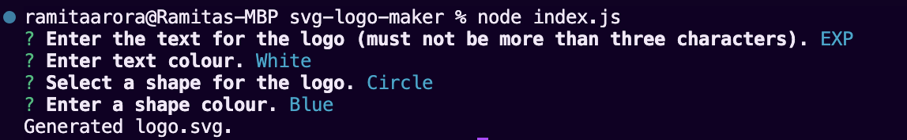

# SVG Logo Maker

## UCLA Bootcamp Module 10 Challenge

## Description

In this project, the user will be able to generate a svg logo file. The user is taken through a series of prompts that will ask:
1. The logo text (cannot be more than three characters)
2. The colour of the text
3. The choice of shape (Circle, Square, Triangle)
4. The colour of the shape

Upon answering the question, a logo.svg file will be created in the directory according to the user's specifications.

## Installation

To install, run `npm install`.
To run, run `node index.js`.

## Usage

A video can be viewed at https://drive.google.com/file/d/14LGt-MD6IVHUIo2cKiGAD8t-3vx0hDTU/view.

The sample SVG can be found at https://github.com/ramitaarora/svg-logo-maker/blob/main/logo.svg or seen here:

## Tests

To run tests, run `npm test`.

## Credits

This project was created by Ramita Indurkhya.